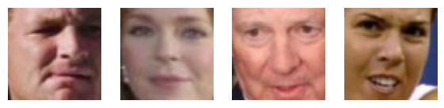
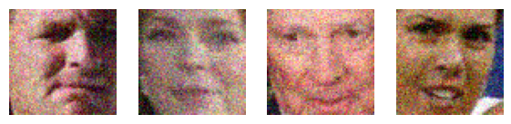
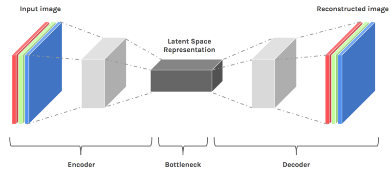
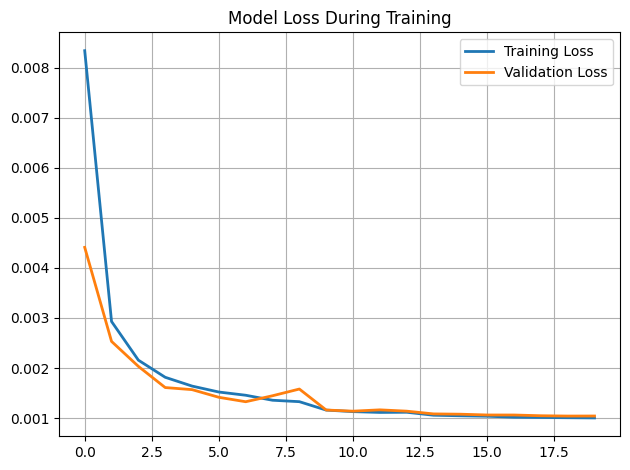
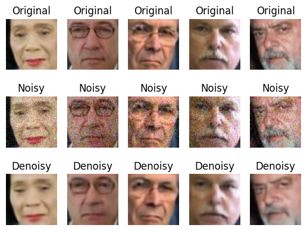
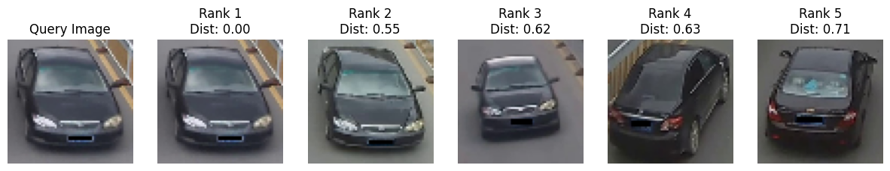
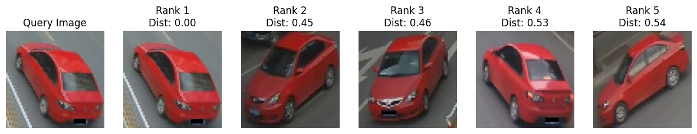
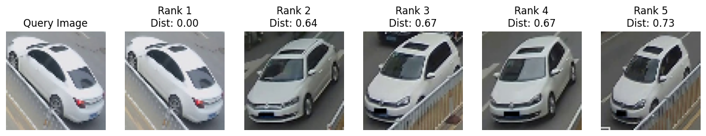

# Deep-Learning-Applications-in-Image-Processing-Denoising-and-Vehicle-Re-identification

## Image Denoising

### Visualisation of the dataset

To better understand our training dataset, we are displaying some sample.

  

Now we have added a random noise :

  

### Encoder - Decoder structure

Design a fully convolutional network with an encoder-decoder structure.

The encoder will consist of convolutional and pooling layers, and the decoder will use upsampling layers to reconstruct the denoised images.

More precisely, our autoencoder is a convolutional neural network with : an encoder that compresses 64x64 RGB images into an 8x8x256 representation, and a decoder that reconstructs the images back to their original size. It uses Conv2D, MaxPooling2D, and UpSampling2D layers, with ReLU activations in hidden layers and a sigmoid activation in the output layer also the model is optimized using the Adam optimizer and mean squared error loss.

  

### Training curve

  

### Encoder - Decoder structure

The model performance on the noisy test images can be evaluated based on the visual quality of the denoised images and the quantitative test loss (MSE). The denoised images appear cleaner with less visible noise compared to the noisy inputs, and they closely resemble the original clean images. .

As we can the quality is very good and the test loss is very small **1 e-03**

  

## Image retrieval for vehicle re-identification

### Model Description 
These are the different component for build our model :

- **Triplet Generation:** We create triplets of images for training the network. Each triplet consists of an anchor image, a positive image (from the same vehicle as the anchor), and a negative image (from a different vehicle).

- **Embedding Network Design:** We design a Convolutional Neural Network (CNN) architecture to extract feature embeddings from the images. This network typically consists of several convolutional layers followed by pooling layers to reduce spatial dimensions, and dense layers to learn the final embedding space.(128 in our case)

- **Triplet Loss Function:** We implement the triplet loss function, which ensures that the distance between the anchor and positive embeddings is minimized, while the distance between the anchor and negative embeddings is maximized. Use the Euclidean distance metric to compute these distances and incorporate a margin parameter to control the embedding space.

- **Model Creation:** We construct a model that takes triplets of images as input and outputs their embeddings.

### Evaluation 
We evaluate the retrieval performance using Mean Average Precision (mAP). We compute the average precision for each query image based on the ranked list of test images, and then average these precision values over all queries to obtain the mAP score.

  
  
  

### Conclusion

So, while building a CNN from scratch provided valuable insights into the complexities of model design and parameter optimization, the next logical step involves utilizing pretrained models. This approach is anticipated to significantly boost the accuracy and effectiveness of our vehicle re-identification system, surpassing the current mAP of 30% and leading to more reliable retrieval results.